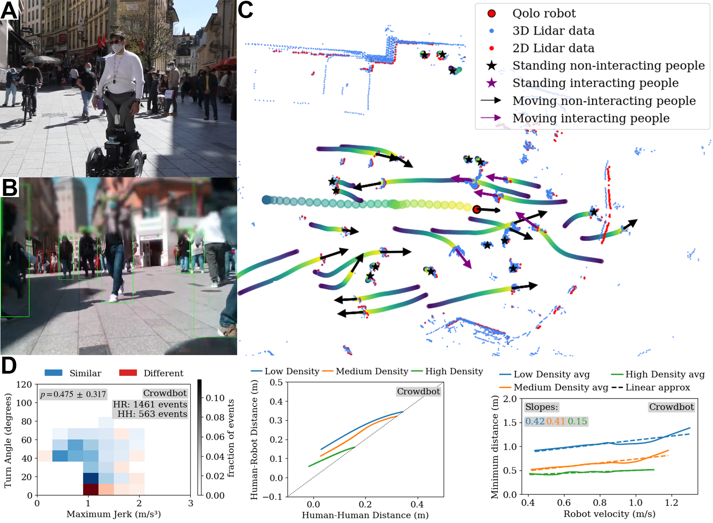
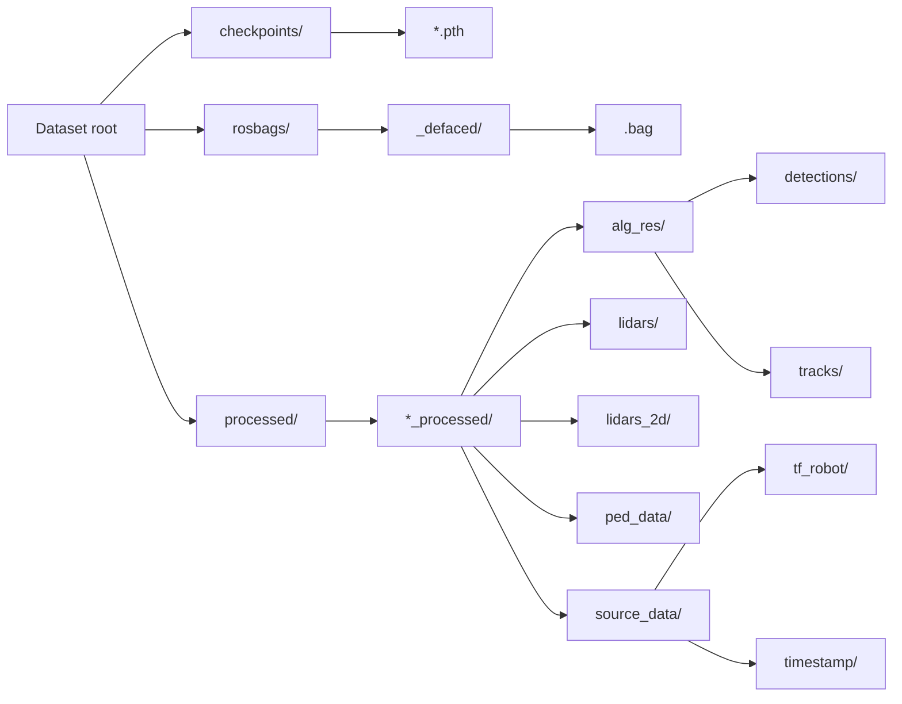
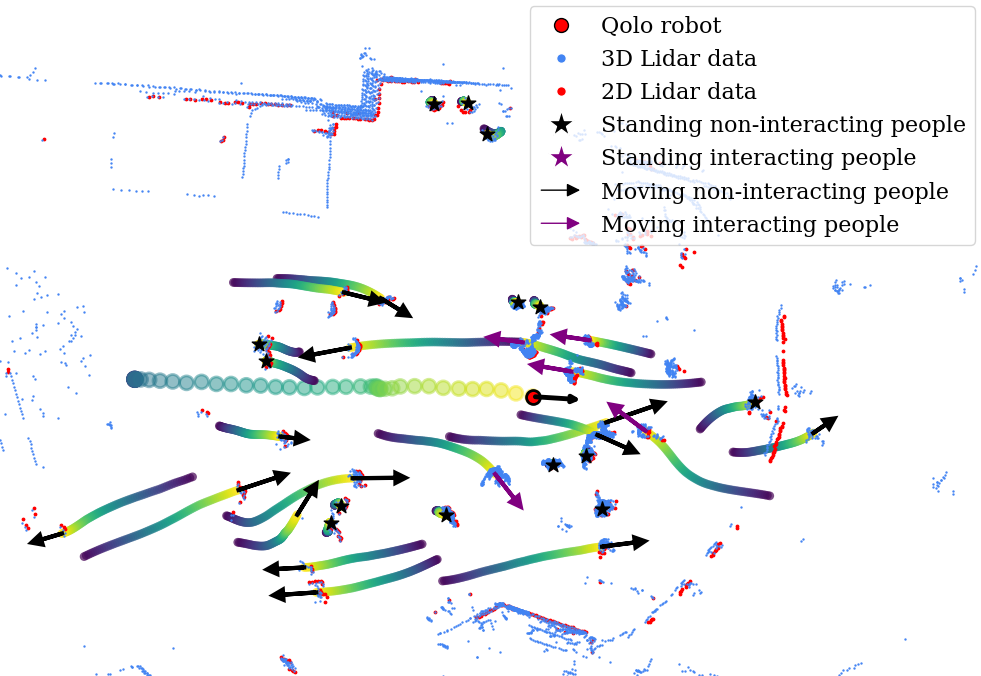
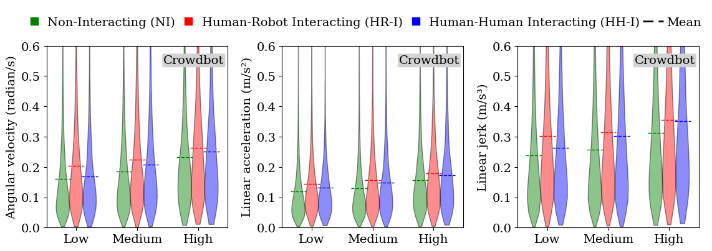
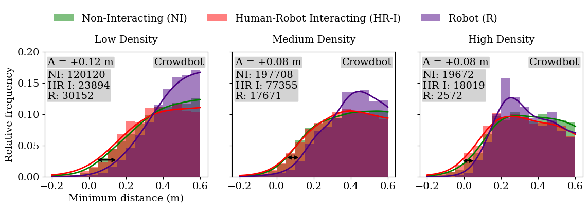
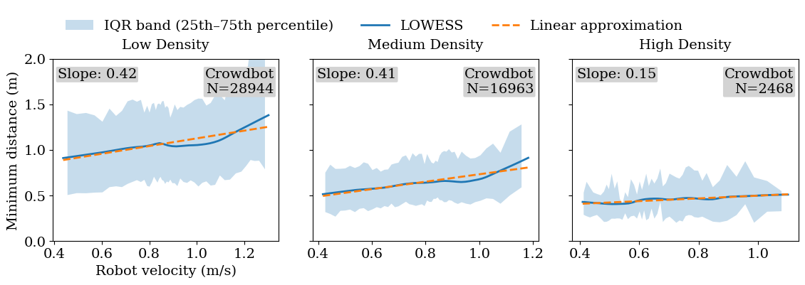

# Overview of the Crowd Analysis Setup

<p align="center">
  <!-- Placeholder: Overview GIF image -->
  
</p>

This repository accompanies an academic **publication**, an **updated, improved version of the Crowdbot dataset**, and a **dataset** collection. It provides a reproducible **analysis pipeline for pedestrian behavior in crowds**. By analyzing motion metrics and **proxemics**, we study differences between **human–human interactions (HHI)** and **human–robot interactions (HRI)** in crowded public spaces across the **Crowdbot**, **JRDB**, and **SiT** datasets.

---

## Files & Folders

The repository layout is as follows (key items):

- `AB3DMOT/` — LiDAR-based tracking (**package:** `ab3dmot`), original repo: https://github.com/xinshuoweng/AB3DMOT
- `checkpoints/` — pre-trained detector weights (e.g., DR-SPAAM, Person_MinkUNet). Uploaded together with the dataset.
- `crowd_analysis/`
  - `crowd_behavior.ipynb` — main analysis notebook with all motion metrics and proxemics analysis
- `datasets_configs/` — dataset configuration YAMLs
  - `data_path_Crowdbot.yaml`
  - `data_path_JRDB.yaml`
  - `data_path_SiT.yaml`
- `datasets_utils/` — dataset utilities (**package:** `crowdbot_data`) used by both environments
- `lidar_det_2D_3D/` — LiDAR detection (**package:** `lidar_det`) combining
  - Person_MinkUNet (3D): https://github.com/VisualComputingInstitute/Person_MinkUNet
  - DR-SPAAM (2D): https://github.com/VisualComputingInstitute/DR-SPAAM-Detector
- `rosbags_extraction/` — scripts for ROS bag processing
  - `1_Lidar_from_rosbags.py`
  - `2_Pose_from_rosbags.py`
  - `3_Detections_from_lidar.py`
  - `4_Tracks_from_detections.py`
  - `Extract_gt_JRDB.py`
  - `Extract_SiT.py`
- `run_pipeline.sh` — script with a full processing pipeline for generating the input data
- `requirements.txt` — Python packages installed into `crowd_env`

---

## Dataset

### Structure



### Demo

| Item | Preview |
|------|---------|
| (a) Pedestrian trajectories |  |
| (b) Motion metrics distributions |  |
| (c) Minimum distance distributions |  |
| (d) Linear minimum distance vs. robot velocity |  |

---

## Proposed/Recommended environment setup with tested package versions

Python version used: **3.8.10**

Two Conda environments are used:

- **`ros_env`** — ROS I/O from rosbags (bag reading, TF transforms, message types).
- **`crowd_env`** — Deep-learning detection/tracking + analysis/visualization.

### 1) Create `ros_env` (RoboStack Noetic)

RoboStack brings ROS Noetic into Conda directly (guide: https://robostack.github.io/noetic.html).

```bash
mamba create -n ros_env -c conda-forge -c robostack-noetic ros-noetic-desktop ros-noetic-tf2-sensor-msgs
mamba activate ros_env

# Minimal math/transforms used by ros-side scripts
pip install scipy==1.16.2 numpy-quaternion==2024.0.12
```

RoboStack already provides the compiled message/runtime bits; no extra `apt` is needed.

### 2) Create `crowd_env`

Create the environment (CUDA 11.8 + PyTorch 2.0.0 as tested):

```bash
mamba create -n crowd_env   python=3.8.10 ipykernel   cuda-toolkit   pytorch==2.0.0 torchvision==0.15.0 torchaudio==2.0.0 pytorch-cuda=11.8   setuptools=69.5.1   mkl=2023.2.0 mkl-include=2023.2.0 mkl-devel=2023.2.0   -c "nvidia/label/cuda-11.8.0" -c pytorch -c nvidia
mamba activate crowd_env

# Install remaining packages for crowd_env
pip install -r requirements.txt
```

#### TorchSparse (install from source — version 2.0.0)

`torchsparse==2.0.0` is required for 3D detection and must be installed **from source**. See the official repository/instructions:  
https://github.com/mit-han-lab/torchsparse

Ensure your PyTorch CUDA version is compatible (this setup uses CUDA **11.8** with PyTorch **2.0.0**).

### Local packages (editable installs)

- Install in both `ros_env` and `crowd_env`:
  ```bash
  # Dataset Utils (package: crowdbot_data)
  mamba activate ros_env && pip install -e ./datasets_utils
  mamba activate crowd_env && pip install -e ./datasets_utils
  ```

- Install only in `crowd_env`:
  ```bash
  # LiDAR Detection (package: lidar_det)
  pip install -e ./lidar_det_2D_3D
  # internal libs
  pip install -e ./lidar_det_2D_3D/lib/iou3d
  pip install -e ./lidar_det_2D_3D/lib/jrdb_det3d_eval

  # LiDAR-based Tracking (package: ab3dmot) — original repo: https://github.com/xinshuoweng/AB3DMOT
  pip install -e ./AB3DMOT
  ```

---

## Pipeline overview

The repository provides `.ipynb` and `.py` processing scripts. They take as input **processed rosbags** or **prepared LiDAR data** from **Crowdbot**, **JRDB**, and **SiT**, and produce outputs in a unified **Crowdbot data convention** for crowd behavior analysis.

### Four processing stages

1. **`1_Lidar_from_rosbags.py`** — For **Crowdbot** and **JRDB**: extracts 2D/3D LiDAR scans from rosbags and transforms them to the **global frame**. Saves synchronized LiDAR timestamps. *(uses `ros_env`)*
2. **`2_Pose_from_rosbags.py`** — For **Crowdbot** and **JRDB**: extracts robot pose, upsamples to 200 Hz, applies smoothing, and computes **velocity**, **acceleration**, and **jerk**. Synchronizes pose timestamps with LiDAR. *(uses `ros_env`)*
3. **`3_Detections_from_lidar.py`** — For **Crowdbot**, **JRDB**, and **SiT**: runs 2D (DR-SPAAM) and 3D (Person_MinkUNet) detectors on prepared LiDAR data (**no rosbags**). Produces 2D-only, 3D-only, and merged close–far detections. *(uses `crowd_env`)*
4. **`4_Tracks_from_detections.py`** — For **Crowdbot**, **JRDB**, and **SiT**: builds tracks with **AB3DMOT** from detections (**no rosbags**). Produces 2D/3D/merged tracks. *(uses `crowd_env`)*

### Dataset-specific extractors

- **`Extract_gt_JRDB.py`** — extracts **ground truth** for **JRDB** only.
- **`Extract_SiT.py`** — extracts **LiDAR**, **egomotion**, and **labels** for **SiT**.

### Automated full pipeline

```bash
bash run_pipeline.sh
```

---

## References:

<!-- Place your references here -->

---

## Acknowledgment

This research work was partially supported by the Innosuisse Project 103.421 IP-IC "Developing an AI-enabled Robotic Personal Vehicle for Reduced Mobility Population in Complex Environments" and the JST Moonshot R\&D [Grant Number JPMJMS2034-18].