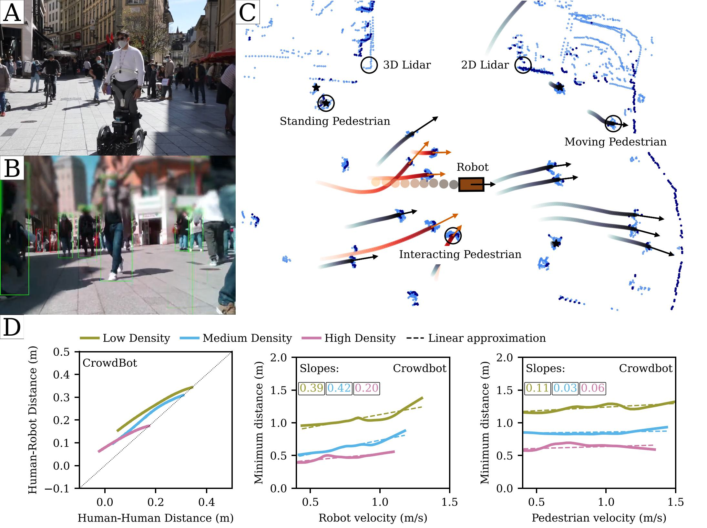
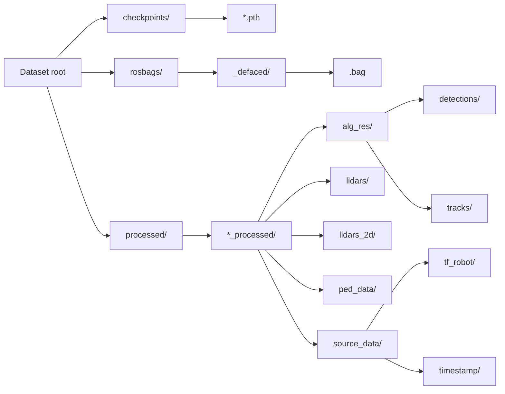
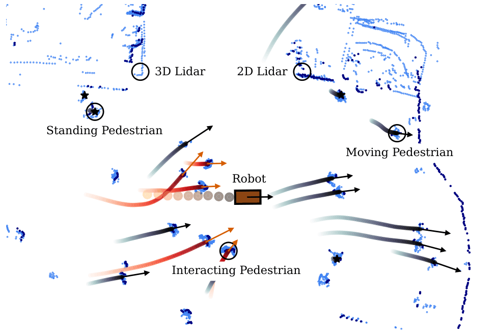
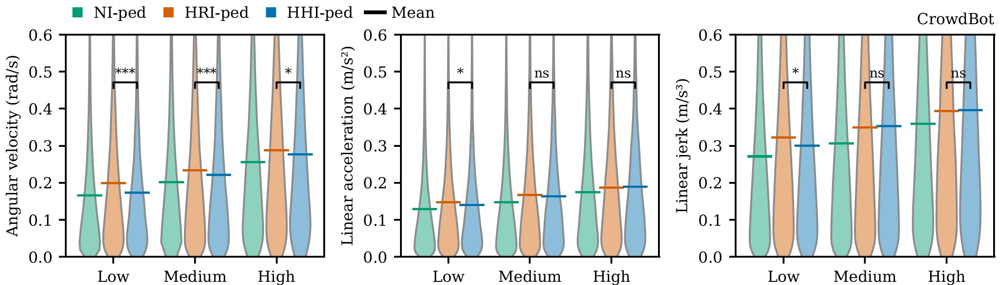
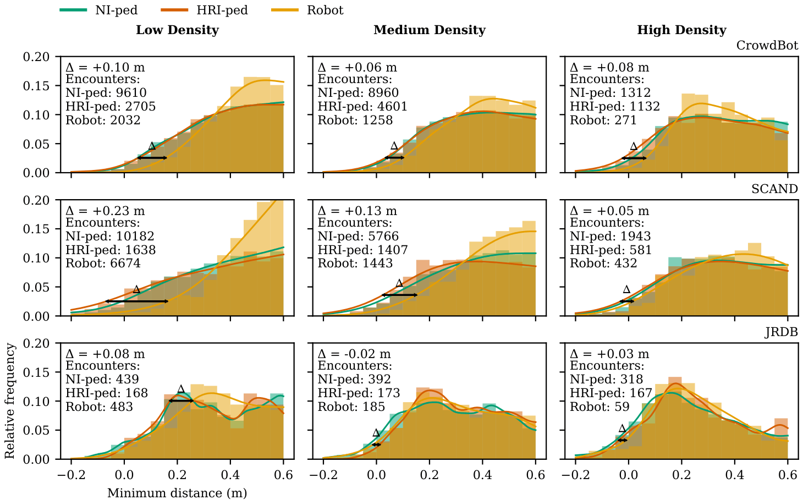
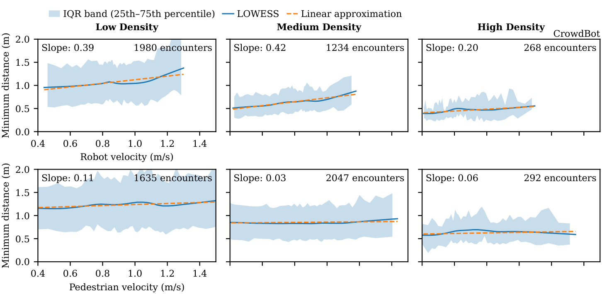

# Overview of the Crowd Analysis Setup

<p align="center">
  <!-- Placeholder: Overview GIF image -->
  
</p>

This repository accompanies an academic **publication**, and an **[updated, improved version of the Crowdbot dataset](https://zenodo.org/records/17694140)**. It provides a reproducible **analysis pipeline for pedestrian behavior in crowds**. By analyzing motion metrics and **proxemics**, we study differences between **human–human interactions (HHI)** and **human–robot interactions (HRI)** in crowded public spaces across **CrowdBot**, **SCAND**, **JRDB** (train and test), and **SiT**.

---

## Files & Folders

The repository layout is as follows (key items):

- `AB3DMOT/` — LiDAR-based tracking (**package:** `ab3dmot`), original repo: https://github.com/xinshuoweng/AB3DMOT
- `checkpoints/` — pre-trained detector weights (e.g., DR-SPAAM, Person_MinkUNet). Uploaded together with the dataset.
- `crowd_analysis/`
  - `crowd_behavior.ipynb` — main analysis notebook with all motion metrics and proxemics analysis
- `datasets_configs/` — dataset configuration YAMLs
  - `data_path_Crowdbot.yaml`
  - `data_path_JRDB.yaml`
  - `data_path_SCAND.yaml`
  - `data_path_SiT.yaml`
- `datasets_utils/` — dataset utilities (**package:** `crowdbot_data`) used by both environments
- `lidar_det_2D_3D/` — LiDAR detection (**package:** `lidar_det`) combining
  - Person_MinkUNet (3D): https://github.com/VisualComputingInstitute/Person_MinkUNet
  - DR-SPAAM (2D): https://github.com/VisualComputingInstitute/DR-SPAAM-Detector
- `rosbags_extraction/` — scripts for ROS bag processing
  - `1_Lidar_from_rosbags.py`
  - `2_Pose_from_rosbags.py`
  - `3_Detections_from_lidar.py`
  - `4_Tracks_from_detections.py`
  - `Extract_gt_JRDB.py`
  - `Extract_SiT.py`
- `run_pipeline.sh` — script with a full processing pipeline for generating the input data
- `requirements.txt` — Python packages installed into `crowd_env`

---

## Dataset

### Structure


``` mermaid
graph LR;
ROOT[Dataset root];
ROOT-->CK[checkpoints/];
CK-->CKP[*.pth];

ROOT-->RB[rosbags/];
RB-->RBX[_defaced/];
RBX-->BAGS[.bag];

ROOT-->PR[processed/];
PR-->PRX[*_processed/];
PRX-->ALG[alg_res/];
ALG-->DET[detections/];
ALG-->TRK[tracks/];
PRX-->L3D[lidars/];
PRX-->L2D[lidars_2d/];
PRX-->PED[ped_data/];
PRX-->SRC[source_data/];
SRC-->TF[tf_robot/];
SRC-->TS[timestamp/];
```

### Demo

| Item | Preview |
|------|---------|
| (a) Pedestrian trajectories |  |
| (b) Motion metrics distributions |  |
| (c) Minimum distance distributions |  |
| (d) Linear minimum distance vs. robot velocity |  |

---

## Proposed/Recommended environment setup with tested package versions

Python version used: **3.8.10**

Two Conda environments are used:

- **`ros_env`** — ROS I/O from rosbags (bag reading, TF transforms, message types).
- **`crowd_env`** — Deep-learning detection/tracking + analysis/visualization.

### 1) Create `ros_env` (RoboStack Noetic)

RoboStack brings ROS Noetic into Conda directly (guide: https://robostack.github.io/noetic.html).

```bash
mamba create -n ros_env -c conda-forge -c robostack-noetic ros-noetic-desktop ros-noetic-tf2-sensor-msgs
mamba activate ros_env

# Minimal math/transforms used by ros-side scripts
pip install scipy==1.16.2 numpy-quaternion==2024.0.12
pip install python-lzf==0.2.4
```

SCAND recordings that expose only `/velodyne_packets` also require `velodyne-decoder` in `ros_env`. Recordings containing `/velodyne_points` do not need it.

RoboStack already provides the compiled message/runtime bits; no extra `apt` is needed.

### 2) Create `crowd_env`

Create the environment (CUDA 11.8 + PyTorch 2.0.0 as tested):

```bash
mamba create -n crowd_env   python=3.8.10 ipykernel   cuda-toolkit   pytorch==2.0.0 torchvision==0.15.0 torchaudio==2.0.0 pytorch-cuda=11.8   setuptools=69.5.1   mkl=2023.2.0 mkl-include=2023.2.0 mkl-devel=2023.2.0   -c "nvidia/label/cuda-11.8.0" -c pytorch -c nvidia
mamba activate crowd_env

# Install remaining packages for crowd_env
pip install -r requirements.txt
```

#### TorchSparse (install from source — version 2.0.0)

`torchsparse==2.0.0` is required for 3D detection and must be installed **from source**. See the official repository/instructions:  
https://github.com/mit-han-lab/torchsparse

Ensure your PyTorch CUDA version is compatible (this setup uses CUDA **11.8** with PyTorch **2.0.0**).

### Local packages (editable installs)

- Install in both `ros_env` and `crowd_env`:
  ```bash
  # Dataset Utils (package: crowdbot_data)
  mamba activate ros_env && pip install -e ./datasets_utils
  mamba activate crowd_env && pip install -e ./datasets_utils
  ```

- Install only in `crowd_env`:
  ```bash
  # LiDAR Detection (package: lidar_det)
  pip install -e ./lidar_det_2D_3D
  # internal libs
  pip install -e ./lidar_det_2D_3D/lib/iou3d
  pip install -e ./lidar_det_2D_3D/lib/jrdb_det3d_eval

  # LiDAR-based Tracking (package: ab3dmot) — original repo: https://github.com/xinshuoweng/AB3DMOT
  pip install -e ./AB3DMOT
  ```

---

## Pipeline overview

The repository provides `.ipynb` and `.py` processing scripts. They take as input **processed rosbags** or **prepared LiDAR data** from **CrowdBot**, **SCAND**, **JRDB**, and **SiT**, and produce outputs in a unified **CrowdBot data convention** for crowd behavior analysis.

Before running anything, edit the YAML files in `datasets_configs/`. Relative values are resolved from the YAML file's directory (the checked-in examples therefore point to the repository's `data/` directory); absolute paths and environment variables are also accepted. Run the commands below from the repository root.

### Four processing stages

1. **`1_Lidar_from_rosbags.py`** — Extracts synchronized 2D/3D lidar for **CrowdBot**, **JRDB train**, and **SCAND**. For **JRDB test**, it reads the released upper/lower PCD streams, timestamps, and SteamLO odometry directly. *(uses `ros_env`)*
2. **`2_Pose_from_rosbags.py`** — Extracts and interpolates robot pose for **CrowdBot**, **JRDB**, and **SCAND**; JRDB test poses are loaded from SteamLO CSV files. *(uses `ros_env`)*
3. **`3_Detections_from_lidar.py`** — Runs 3D Person-MinkUNet and optional 2D DR-SPAAM detection. JRDB test is 3D-only because its released test set has no matching 2D lidar stream. *(uses `crowd_env`)*
4. **`4_Tracks_from_detections.py`** — Builds 3D and optional merged 2D/3D tracks with **AB3DMOT**. *(uses `crowd_env`)*

### Dataset-specific extractors

- **`Extract_gt_JRDB.py`** — extracts **ground truth** for **JRDB** only.
- **`Extract_SiT.py`** — extracts **LiDAR**, **egomotion**, and **labels** for **SiT**.

### Full pipeline

Every Python stage has an explicit command-line interface; use `--help` for all options. The wrapper accepts a dataset, path YAML, logical folder, 3D checkpoint, and optional 2D checkpoint:

```bash
bash rosbags_extraction/run_pipeline.sh \
  CrowdBot datasets_configs/data_path_Crowdbot.yaml 0325_rds_defaced \
  checkpoints/ckpt_e40_train_val.pth \
  checkpoints/jrdb_dr_spaam_with_bev_box_e20.pth
```

For JRDB train, set `JRDB_TRAIN_TIMESTAMPS_ROOT`. For JRDB test, set both `JRDB_TEST_ROOT` and `JRDB_TEST_ODOM_ROOT`; omit the optional 2D model argument. SCAND resolves the Jackal/Spot odometry and lidar topics from each bag automatically.

### Revised analysis notebook

Open `crowd_analysis/crowd_behavior.ipynb` after the tracking outputs exist. Its first parameter cell resolves repository paths, selects one dataset, and documents the final settings. Run the extraction/filtering sections once for each of `CROWDBOT`, `JRDB`, `SCAND`, and `SiT`; the registration cell retains each dataset's result tables for the cross-dataset plots.

The curated notebook contains the analyses retained in the revised manuscript:

- cubic Savitzky–Golay position smoothing over 1.5 s, followed by finite-horizon differences (1 s velocity, acceleration, and turning; 0.5 s jerk);
- symmetric co-motion exclusion using at least 1 s of shared observations and a 2 m maximum distance excursion, plus the reported threshold sensitivity;
- per-pedestrian Mann–Whitney tests and group-level Wasserstein-1 effect sizes;
- significant-event detection (turn above 45° or speed change above 2 km/h within 1 s) and the joint energy-distance test;
- edge-to-edge close-pass KDE analysis, equalization distance, and maximum excess clearance;
- comfort-zone intrusion frequencies, density stratification on 4 s fragments, and robot/pedestrian speed controls using robust LOWESS (`frac=0.3`, two robust iterations).

---

## References:

Please cite both the dataset as well as the publication if you use our dataset/repository in your work.

### Crowdbot_v2 dataset
Wojcikiewicz, D., Billard, A., & Paez-Granados, D. (2025). CrowdBot_v2: Pedestrian–Robot crowd navigation dataset with pedestrian tracking (v2.0) [Data set]. Zenodo. https://doi.org/10.5281/zenodo.17694140

### Academic Publication
Wojcikiewicz D., Billard A., Paez-Granados D. Assessing pedestrian responses to autonomous and personal mobility robots in crowded public spaces. Science Advances (2026). https://doi.org/10.1126/sciadv.aef2576

---

## Acknowledgment

This research work was partially supported by the Innosuisse Project 103.421 IP-IC "Developing an AI-enabled Robotic Personal Vehicle for Reduced Mobility Population in Complex Environments" and the JST Moonshot R\&D [Grant Number JPMJMS2034-18].
